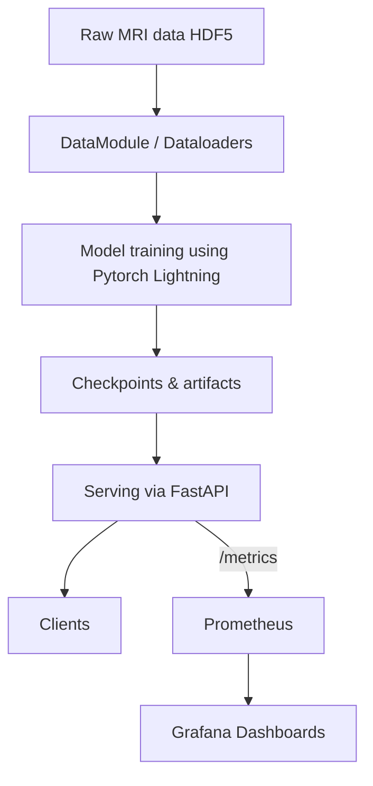
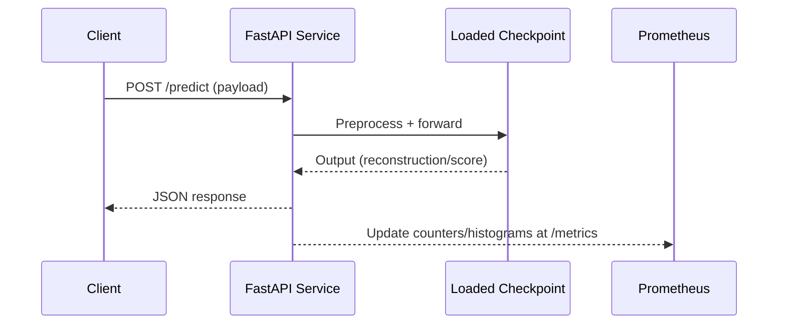
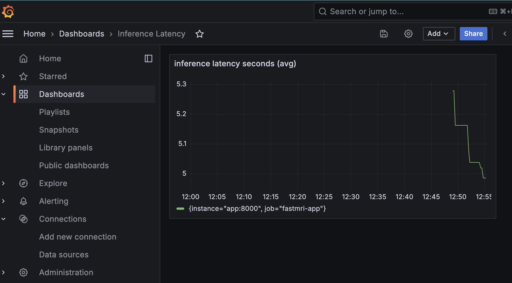

# fastmri

## Introduction
This repository contains an end-to-end workflow for deep learning on knee MRI data: training, evaluation, and serving a FastAPI inference service with production-friendly monitoring (Prometheus + Grafana). It uses modern Python packaging (`uv`), Hydra-style configs, and ML experiment tracking.

## Project objective
- Train a model on provided knee MRI datasets and log runs/artifacts.
- Serve trained checkpoints via a FastAPI endpoint for real-time inference.
- Expose operational and application metrics for observability and troubleshooting.

## Architecture

Request flow (serving):

## Dataset Access
This project uses the FastMRI dataset for knee MRI reconstruction. To access the dataset:

1. **Register and download**: Visit the [FastMRI official website](https://fastmri.org/) and register for access
2. **Download knee data**: Download the knee single-coil validation set (knee_singlecoil_val.tar.xz)
3. **Extract and organize**: Place training/validation HDF5 files in the appropriate directories:
   - Training data: `data/train/`
   - Validation data: `data/val/`
4. **Alternative datasets**: The code can be adapted for other MRI datasets by modifying the data loading configuration in `configs/datamodule.yaml`

**Note**: The dataset contains anonymized knee MRI scans in HDF5 format, with both fully-sampled and undersampled k-space data for training reconstruction models.

## How to run
- Dependencies (use `uv`):
  
    ``uv sync``

- Prepare data:
  Place training/validation HDF5 files under `data/train` and `data/val`. Adjust paths in `configs/datamodule.yaml` if needed.

- Train:
  
  ``python scripts/train.py --config configs/config.yaml``

- Evaluate:
  python scripts/evaluate.py --run_id <RUN_ID>

- Local serving (FastAPI):
  
  ``python scripts/serve.py --run_id <RUN_ID> --host 0.0.0.0 --port 8000``

- Docker (serve only):  
  * ``bash docker build -t fastmri-serve .``  
  * `` docker run --rm -p 8000:8000 fastmri-serve``
  * ``python scripts/serve.py --run_id <RUN_ID> --host 0.0.0.0 --port 8000``

- Monitoring (Prometheus + Grafana): 
  * ``uv sync``  
  * ``docker compose up -d --build``
  
  ### Prometheus: http://localhost:9090
  ### Grafana: http://localhost:3000 (admin/admin)
  ## metrics: 
    * http requests count
    * hardware metrics (cpu, memory, process)

  # Tear down:
  docker compose down

  ## Grafana Dashboard
  

## Pitfalls
- Splitting validation set incorrectly can cause data leakage. Keep patient/series-level splits consistent.
- Ensure the `--run_id` corresponds to a checkpoint available locally (e.g., under `mlflow_artifacts/checkpoints`); otherwise serving will fail to load weights.
- GPU/CPU memory: batch size and patch size may need tuning for your hardware.
- Port conflicts: change `--port` or stop other services using 8000/9090/3000.